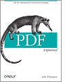

# *PDF Explained* （译作《PDF 解析》）

## 项目简介
这是*PDF Explained*的非官方中文翻译版, 大体已经完成, 还需要完善很多细节部分。
详见[ISSUE](https://github.com/zxyle/PDF_Explained/issues) 希望得到你们的帮助！让项目越来越完善，帮助更多的人入门PDF，在此表示感谢！

## 原书简介
这是对广泛使用的可移植文档格式的平易近人的介绍。
PDF无处不在，无论是在线形式还是印刷形式，但很少有人利用这些有用的功能或掌握这种格式的细微差别。
这本简明的书籍为程序员，高级用户提供了世界领先的页面描述语言(pdf)的动手实践。以及搜索，电子出版和印刷行业的专业人士，
有大量示例，本书是你完全理解PDF所需的文档。

## 原书概要
- 在文本编辑器中从头开始构建简单的PDF文件
- 了解PDF文件的布局和内容，以及其对象的语法
- 检查PDF对象的逻辑结构，并了解如何将页面及其资源安排到文档中
- 在PDF中创建矢量图形和光栅图像，并处理透明度，色彩空间和图案
- 探索pdf运算符以构建和显示文本字符串
- 快速了解书签，元数据，超链接，注释和文件附件
- 了解PDF中的加密和文档权限如何工作
- 使用pdftk程序从命令行处理PDF文件

## 目录
* [前言](./preface.md)
* [第1章 - 介绍](./chapter1.md)
* [第2章 - 构建一个简单PDF文件](./chapter2.md)
* [第3章 - 文件结构](./chapter3.md) 
* [第4章 - 文档结构](./chapter4.md)
* [第5章 - 图形](./chapter5.md) 
* [第6章 - 文本和字体](./chapter6.md) 
* [第7章 - 文档元数据和导航](./chapter7.md) 
* [第8章 - 加密文档](./chapter8.md) 
* [第9章 - 使用Pdftk](./chapter9.md) 
* [第10章 - PDF软件和文档](./chapter10.md)
* [译者注](./Note.md)

## 示例文件及勘误表
* 原书代码见[O'Reilly repo](https://resources.oreilly.com/examples/0636920021483/)
* 代码见[examples](./examples)目录
* [官方勘误表](https://www.oreilly.com/catalog/errata.csp?isbn=9781449310028)

## 参考资源
* [Amazon英文版购买](https://www.amazon.com/PDF-Explained-Standard-Document-Exchange/dp/1449310028)
* [pdf1.7标准参考](./resources/pdf_reference_1.7.pdf)

## 贡献者
- [Xiang Zheng](https://github.com/zxyle)
- [LearningPawn5](https://github.com/LearningPawn)
- [woclass](https://github.com/inkydragon)

## 当前翻译状态
持续翻译中... 欢迎[PR](https://github.com/zxyle/PDF_Explained/pulls)或者[ISSUE](https://github.com/zxyle/PDF_Explained/issues)。
